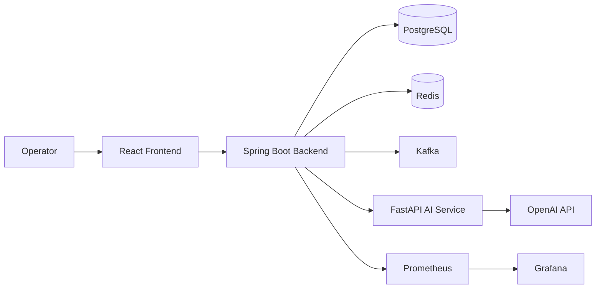
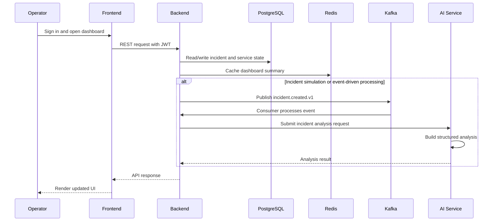
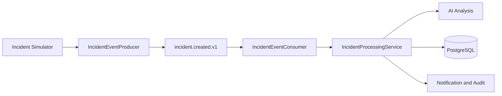
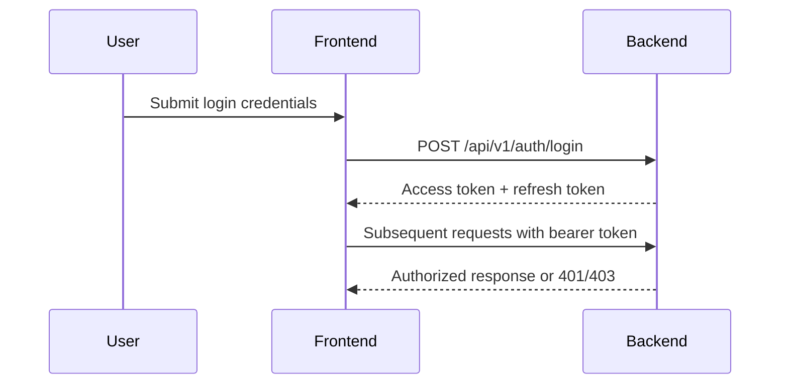
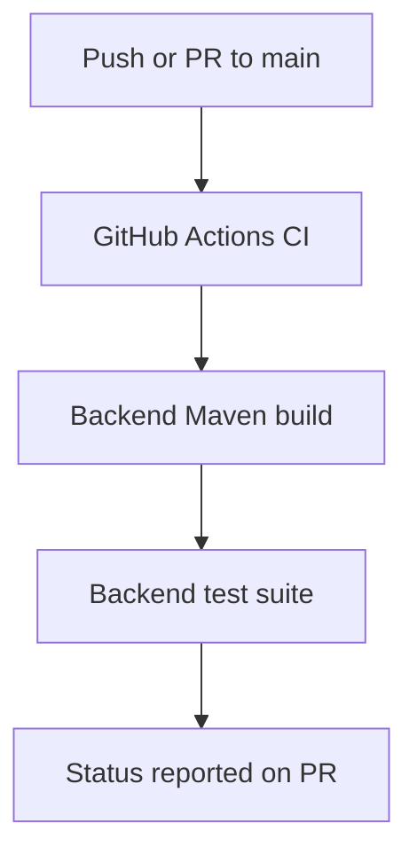
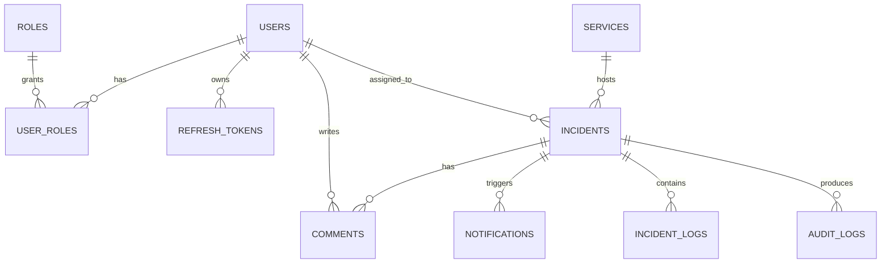
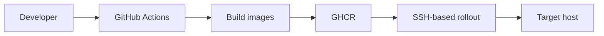

# FinSight AI

A containerized incident intelligence platform for operational triage, service monitoring, and AI-assisted investigation workflows.

## Overview

FinSight AI is a full-stack monorepo for managing incident response workflows in a simulated enterprise operations environment. The project combines a Spring Boot backend, a FastAPI AI analysis service, and a React-based operator dashboard to support incident investigation, service monitoring, analytics, and workflow updates from a single experience.

The solution exists to demonstrate how incident data can be surfaced to operators through a structured backend API, enriched with AI-generated analysis, and presented through a responsive web interface. In practical terms, the platform is designed for internal operations teams that need a lightweight incident command center for triage and investigation.

### What the project currently provides

- Incident lifecycle management with assignment, status transition, resolution, and comment workflows
- Service health and operational monitoring views backed by relational data and Redis cache
- AI-assisted analysis of incidents based on recent logs and incident context
- Observability support through Prometheus and Grafana
- Containerized local and production-style deployment using Docker Compose and GHCR-based image publishing

### Status

This repository is a working engineering prototype with seeded demo data and container-based infrastructure. Some operational capabilities are present and documented, while others remain partially implemented.

## Key Features

### Backend

- REST APIs for authentication, system health, dashboard summaries, service monitoring, incident management, log exploration, analytics, and user directory queries
- Role-based authorization for platform administrators and incident analysts
- Persistence for incidents, services, logs, comments, notifications, audits, refresh tokens, and user roles using PostgreSQL and Flyway migrations
- Kafka-based incident event processing for simulation-driven workflows

### Frontend

- React + TypeScript dashboard for incident operations, analytics, logs, and service views
- Route-based lazy loading and React Query-backed data fetching for a responsive user experience
- Incident detail workflows that support assignment, status updates, comments, and resolution actions

### AI

- FastAPI service that accepts incident context and recent logs, then calls the OpenAI Responses API to produce structured analysis sections
- Parsed output includes executive summary, root cause, business impact, confidence score, and suggested resolution
- The AI service is intentionally modular and can be extended to support alternate providers or response formats

### Authentication and Security

- JWT-based access tokens with refresh token support
- Password hashing using BCrypt
- Stateless session handling with Spring Security
- CORS configuration and protected routes for authenticated operator workflows

### Monitoring and Observability

- Spring Boot actuator endpoints for health and Prometheus metrics
- Prometheus and Grafana services included for local observability
- Structured incident and audit logging through backend services

### DevOps

- Docker Compose setup for local development and production-style deployment
- GitHub Actions workflows for backend build/test, image publishing to GHCR, and SSH-based rollout
- Environment-driven configuration for backend, AI service, database, cache, and observability services

### Analytics

- Dashboard metrics for active incidents, critical incidents, open tickets, resolved today, MTTR, and response time
- Operational analytics for incident trends, severity distribution, SLA breach trends, service availability, top failing services, and incident heatmaps

## System Architecture

### High-level architecture



### Request lifecycle



### Kafka event flow



### Authentication flow



### Monitoring architecture


### CI workflow



## Technology Stack

| Layer | Technology | Why it is used |
| --- | --- | --- |
| Frontend | React, TypeScript, Vite | Component-driven interface with fast local development and route-based loading |
| Frontend UI | Tailwind CSS | Lightweight styling for the operations dashboard |
| Frontend Data | React Query, Axios | Declarative fetching, caching, and API integration |
| Frontend Charts | Recharts | Operational charts for trends, distributions, and availability views |
| Backend | Java 21, Spring Boot 3 | Structured application server with dependency injection, MVC controllers, and security support |
| Backend Security | Spring Security, JWT, BCrypt | AuthN/AuthZ and password hashing |
| Backend Data | Spring Data JPA, Hibernate, Flyway | Relational persistence and schema migration |
| Backend Cache | Redis | Dashboard summary caching and lightweight read-model acceleration |
| Messaging | Kafka, Zookeeper | Event-driven incident processing and decoupled workflow handling |
| AI Service | Python, FastAPI, Pydantic | Lightweight API boundary for AI analysis requests |
| AI Provider | OpenAI Python SDK | Structured incident analysis generation |
| Database | PostgreSQL | Primary relational store for incidents, services, users, comments, and audit data |
| DevOps | Docker Compose, GHCR | Local containerization and image-based deployment |
| Monitoring | Prometheus, Grafana | Metrics collection and visualization |
| Testing | JUnit, Spring Test, H2 | Backend unit and integration-style coverage |
| CI/CD | GitHub Actions | Build, test, publish, and rollout workflows |

## Project Structure

The repository is organized as a multi-service monorepo.

- backend contains the Spring Boot application. Its main packages include:
  - controller for REST endpoints
  - service and service/impl for use-case orchestration
  - repository for persistence access
  - domain.entity and domain.enums for the core model
  - events for Kafka producers and consumers
  - security for authentication and JWT handling
  - config for infrastructure and application configuration

- ai-service contains the FastAPI AI boundary. Its responsibilities include:
  - exposing analysis endpoints under app/api/v1
  - validating input through Pydantic schemas
  - constructing prompts and parsing LLM responses
  - loading provider configuration from environment variables

- frontend contains the React application. Its responsibilities include:
  - route-driven pages for dashboard, services, incidents, simulator, logs, and analytics
  - API clients and client-side auth state
  - layout and shared UI composition

- docker-compose.yml and docker-compose.prod.yml define local and production-style container orchestration
- observability contains Prometheus configuration
- .github/workflows contains CI, image publish, and rollout automation
- docs contains architecture and observability documentation

## Installation

### Prerequisites

- Docker Engine and Docker Compose
- Java 21 and Maven for backend builds
- Python 3.12+ and pip for the AI service
- Node.js 20+ and npm for the frontend

### Clone the repository

```bash
git clone <repository-url>
cd "FinSight AI"
```

### Environment setup

Create a root environment file before running the full stack:

```bash
cp .env.prod .env
```

Update values for your local environment, especially secrets and credentials.

### Docker setup

To start the supporting infrastructure and application services:

```bash
docker compose up -d
```

### Running locally

Start the backend:

```bash
cd backend
mvn spring-boot:run
```

Start the AI service:

```bash
cd ai-service
pip install -r requirements.txt
uvicorn app.main:app --reload --port 8001
```

Start the frontend:

```bash
cd frontend
npm install
npm run dev
```

### Running with Docker Compose

The repo includes a development Compose stack that starts PostgreSQL, Redis, Zookeeper, Kafka, the backend, AI service, frontend, Prometheus, and Grafana.

```bash
docker compose up -d
```

## Environment Variables

| Variable | Purpose | Required | Example value |
| --- | --- | --- | --- |
| APP_JWT_SECRET | Signing key for JWT access tokens | Yes | change-me-in-production |
| OPENAI_API_KEY | API key for the AI service | Yes for live AI analysis | sk-... |
| OPENAI_MODEL | Model name used by the AI service | No | gpt-4o-mini |
| POSTGRES_DB | PostgreSQL database name | No | finsight |
| POSTGRES_USER | PostgreSQL username | No | finsight |
| POSTGRES_PASSWORD | PostgreSQL password | No | change-me |
| GRAFANA_ADMIN_USER | Grafana admin username | No | admin |
| GRAFANA_ADMIN_PASSWORD | Grafana admin password | No | change-me |
| REPO_OWNER | GitHub repository owner used by deployment workflows | No for local runs | your-org |
| IMAGE_TAG | Image tag for published container images | No | latest |

> Secrets should be provided through environment files or CI/CD secrets and should never be committed to the repository.

## Running the Application

### Backend

The backend exposes REST APIs on port 8080. The main health endpoint is:

- GET /api/v1/system/health

The application also exposes Spring Boot actuator endpoints:

- /actuator/health
- /actuator/prometheus

### Frontend

The React application is served by Vite in development mode and by the containerized frontend service in Compose-based deployment. The default development URL is:

- http://localhost:5173

### AI Service

The FastAPI service exposes the core analysis endpoint:

- POST /api/v1/analysis/incident

### Docker Compose

The Compose stack exposes:

- Backend: http://localhost:8080
- AI Service: http://localhost:8001
- Frontend: http://localhost:5173
- Prometheus: http://localhost:9090
- Grafana: http://localhost:3000

### Development and Production

- Development uses local service processes and Dockerized infrastructure dependencies
- Production-style deployment uses prebuilt images from GHCR and the Compose production manifest
- The rollout workflow is present but should be treated as partially implemented until validated in a target environment

## API Documentation

The backend includes OpenAPI support through Springdoc. Swagger UI is available at:

- http://localhost:8080/swagger-ui.html
- http://localhost:8080/v3/api-docs

### Key endpoints

| Method | Route | Description | Authentication |
| --- | --- | --- | --- |
| POST | /api/v1/auth/login | Authenticate a user and return JWT tokens | No |
| POST | /api/v1/auth/refresh | Refresh an access token | No |
| POST | /api/v1/auth/logout | Revoke a refresh token | No |
| GET | /api/v1/auth/profile | Retrieve the current user profile | Yes |
| GET | /api/v1/system/health | Return a simple backend health payload | No |
| GET | /api/v1/analyst/dashboard/summary | Return dashboard metrics | Yes |
| GET | /api/v1/analyst/services | List monitored services | Yes |
| POST | /api/v1/analyst/simulator/{scenario} | Trigger an incident simulation event | Yes |
| GET | /api/v1/analyst/incidents | Retrieve paginated incidents with filters and sorting | Yes |
| GET | /api/v1/analyst/incidents/{incidentId} | Retrieve incident details | Yes |
| PATCH | /api/v1/analyst/incidents/{incidentId}/assign | Assign an incident to a user | Yes |
| PATCH | /api/v1/analyst/incidents/{incidentId}/status | Update incident status | Yes |
| PATCH | /api/v1/analyst/incidents/{incidentId}/resolve | Resolve an incident | Yes |
| POST | /api/v1/analyst/incidents/{incidentId}/comments | Add a timeline comment | Yes |
| GET | /api/v1/analyst/logs | Search and paginate incident logs | Yes |
| GET | /api/v1/analyst/analytics/overview | Retrieve analytics overview data | Yes |
| GET | /api/v1/admin/users/count | Return the current user count | Yes, admin role |

## Database Design

The backend uses a relational PostgreSQL schema centered on incidents, services, users, and audit data.

### Core entities

- users and roles manage authentication and authorization
- services represent monitored services and operational health state
- incidents capture incident lifecycle, severity, assignment, and AI-generated enrichment
- incident_logs store log records associated with incidents and services
- comments capture investigation notes and timeline updates
- notifications and audit_logs preserve downstream actions and actions taken by operators
- refresh_tokens store token lifecycle state for session management

### Entity relationship view



The schema is initialized and seeded through Flyway migrations, including seeded users, services, incidents, logs, and audit data for local demos.

## Event-Driven Architecture

Kafka is used for incident event propagation. The current implementation is intentionally simple and focused on one event type.

- Producer: IncidentEventProducer publishes incidents to the topic incident.created.v1
- Consumer: IncidentEventConsumer subscribes to the same topic and invokes incident processing
- Processing flow: the backend loads the incident, gathers recent logs, requests AI analysis, updates incident enrichment fields, and triggers notification/audit actions

### Current implementation notes

- The event flow is implemented and functioning as part of the simulated incident workflow
- Failure handling is currently basic; retries and dead-letter handling are not yet modeled in the repository
- The implementation should be treated as a solid foundation rather than a fully hardened production event platform

## AI Module

The AI module is implemented as a dedicated FastAPI service that receives incident context and recent logs from the backend.

### Workflow

1. The backend gathers incident context and the latest log messages
2. It sends a structured request to the AI service
3. The AI service calls the configured OpenAI model
4. The response is parsed into structured fields for the incident record

### Current capabilities

- Structured output for executive summary, root cause, business impact, confidence score, and suggested resolution
- Basic error handling for missing configuration and provider failures
- Input validation through Pydantic models

### Partially implemented

- The module currently relies on a single provider flow and basic prompt/parse logic
- There is no additional retry policy, fallback provider, or prompt management framework in the repository yet

## Security

The repository implements several baseline security controls relevant to an internal operational platform.

- JWT-based authentication with access and refresh tokens
- BCrypt password hashing for stored credentials
- Role-based access control for admin and analyst workflows
- Stateless backend sessions via Spring Security configuration
- Protected routes for health, auth, Swagger, and analyst/admin APIs
- CORS configuration for browser-based access
- Input validation on request models using Jakarta Validation

### Security considerations

The current implementation is suitable for local development and demo deployment. Production hardening would require additional work around secrets management, deployment isolation, and stronger operational controls.

## Monitoring and Observability

The project includes a baseline observability stack.

- Spring Boot actuator endpoints provide health and Prometheus metrics
- Prometheus scrapes backend metrics for collection and querying
- Grafana provides dashboards for visualizing operational metrics
- Backend services record incident and audit activity for operator review

### Observability endpoints

- /actuator/health
- /actuator/health/readiness
- /actuator/prometheus

## CI/CD

The repository includes GitHub Actions workflows for continuous integration and deployment automation.

### Current workflows

- CI workflow builds the backend and runs the backend test suite
- Deploy workflow builds and publishes backend, frontend, and AI service images to GHCR
- Rollout workflow prepares a deployment environment and applies the production Compose stack over SSH

### Partially implemented

- The CI workflow currently targets the backend test suite and does not yet include frontend or AI service checks
- The deployment and rollout workflows are present but should be validated in an actual target environment before being considered fully production-ready



## Performance Considerations

The implementation includes several practical performance measures that are already reflected in the codebase.

- Redis-backed caching for dashboard summary reads
- Paginated list endpoints for incidents and logs to reduce response size
- React Query and lazy-loaded routes to reduce initial frontend load overhead
- Asynchronous event-based handling for incident processing through Kafka

### Scalability boundaries

The current deployment model is containerized and modular, but it is still oriented toward local or small-scale deployment rather than a fully distributed cloud-native platform.

## Screenshots

Screenshots are not included in the repository at this time. Recommended additions:

- Dashboard view showing active incidents and KPI cards
- Login screen for seeded operator accounts
- Analytics view with charts and incident trends
- Monitoring view showing Prometheus/Grafana integration
- AI analysis panel for incident summaries and suggested actions

## Future Enhancements

The following improvements are realistic next steps and are not yet implemented as first-class features:

- End-to-end test coverage for login, incident workflows, and analytics pages
- Dead-letter queues and retry policy for Kafka failures
- More robust AI provider abstraction and fallback handling
- SSO or identity-provider integration
- Additional audit export and retention controls
- Production-grade secret management and deployment hardening

## Contributing

Contributions are welcome. A practical contribution flow is:

1. Create a feature branch from the current main branch
2. Keep changes scoped to a single concern where possible
3. Update or add tests for backend changes when relevant
4. Document environment variable changes or deployment impact
5. Open a pull request with a concise description of the problem and the implemented solution

## License

No license file is currently present in this repository. Before distributing or reusing the project publicly, add an explicit license that matches your intended usage and redistribution model.
